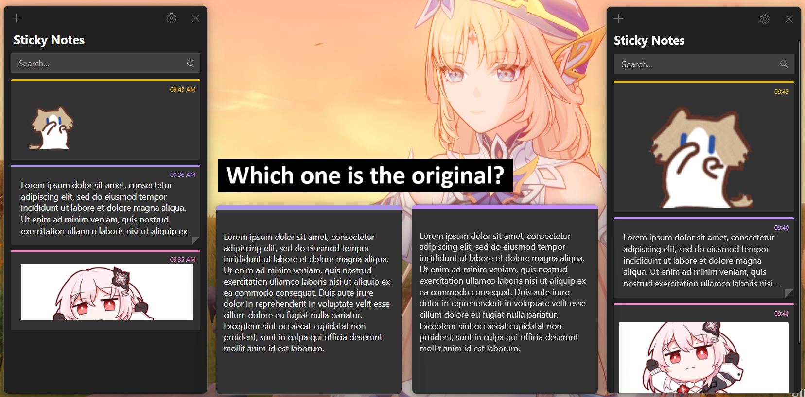

# Nie Sticky Notes
Microsoft Sticky Notes clone but better.


## Features
- **Todo lists** with checkboxes (nestable with Tab)
- **Headings** (`#`, `##`, `###`)
- **Numbered lists**
- **Dividers** (`---`)
- **Inline code and code blocks**
- **Text highlighter**
- **Clickable links**
- **Pin button** — keep a note always on top

Plus the essentials: colors, bold, italic, underline, strikethrough, bullet lists, inline images, and a notes list with live previews.


<br>


## How to install
1. Go to https://github.com/niemakestuff/nie_sticky_notes/releases.
2. Download the latest executable.
3. Run it. No installer needed.


## Tech stack
- TypeScript + Rust
- [Tauri](https://v2.tauri.app/) for cross-platform applications
- [React](https://react.dev/) for frontend framework
- [Tiptap](https://tiptap.dev/) for the rich-text editor


## How to develop

### Prerequisites
- [Node.js](https://nodejs.org/)
- [pnpm](https://pnpm.io/)
- [Tauri prerequisites](https://v2.tauri.app/start/prerequisites/)
- If you're on Linux, read the `shell.nix` for the other dependencies you might need

**If developing from Linux, recommended to use Nix:**
`nix-shell shell.nix`

**If developing from WSL:**
Keep the repo on the Windows filesystem and run every `pnpm` command from a Windows terminal.
`node_modules` contains Windows-native binaries, so those commands break inside WSL.
Everything else (editing, git, `cargo check`) works fine from WSL.

### Commands
```bash
# Run the dev server
pnpm tauri dev

# Build
pnpm tauri build --no-bundle

# Release
./release.sh
```
